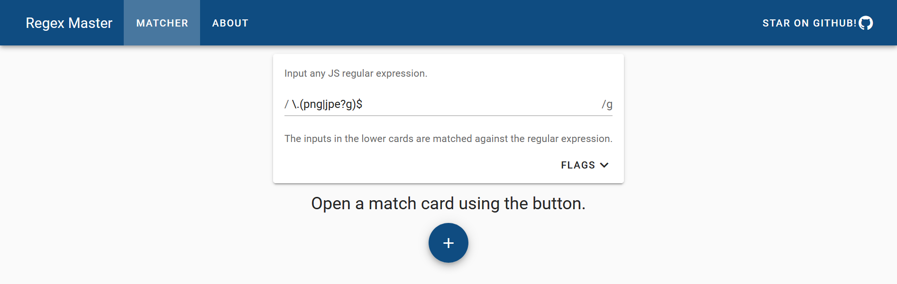

<p align="center">
  <a href="https://lkummer.github.io/regex-master/">
    
  </a>
</p>
<p align="center">
  
  
  
  
  
</p>

Regular expression checking web app that matches against multiple strings. [Hosted on Github Pages](https://lkummer.github.io/regex-master/).

<a href="https://lkummer.github.io/regex-master/">
  
</a>

# Contents

* [Prominent Features](#prominent-features)
* [Development Setup](#development-setup)
* [License](#license)

# Prominent Features

## Multi String Matching

An editable card list for string inputs makes testing a regular expression against multiple different inputs quick and easy.

## Multi Line Input

Match cards allow multiple lines of input and the `m` flag can be enabled, allowing testing of regular expressions against multiple lines of input.

## Mobile First Design

Uses hamburger navigation for smaller screen sizes and designed for a good user experience on mobile.

## Statically Generated

Employs server side rendering for statically generating the application, enabling quick loading and making hosting practically free.

## Light Weight

Just a tad over 500 kB for the first load and under 20 kB for page switches when gzipped.

# Development Setup

To install dependencies:

``` bash
$ npm ci
```

To run a development server with hot reload:

``` bash
$ npm run dev
```

To run the linters:

``` bash
$ npm run lint
```

To generate a static website:

``` bash
$ npm run generate
```

The project uses Github Actions to generate itself and deploy to Github Pages.

# License

This project is licensed under the GNU General Public License 3.0.

## Dependencies

Thanks to the developers of all the dependencies that helped make this project.

* [Nuxt](https://nuxtjs.org/) - GPL V3.0.
* [Vuetify](https://vuetifyjs.com/en/) - MIT.
* [Webpack](https://webpack.js.org/) - MIT.
* [ESLint](https://eslint.org/) - MIT.
* [Stylelint](https://stylelint.io/) - MIT.